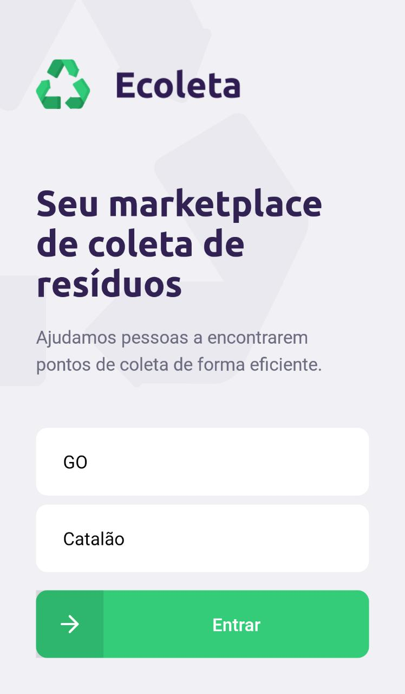
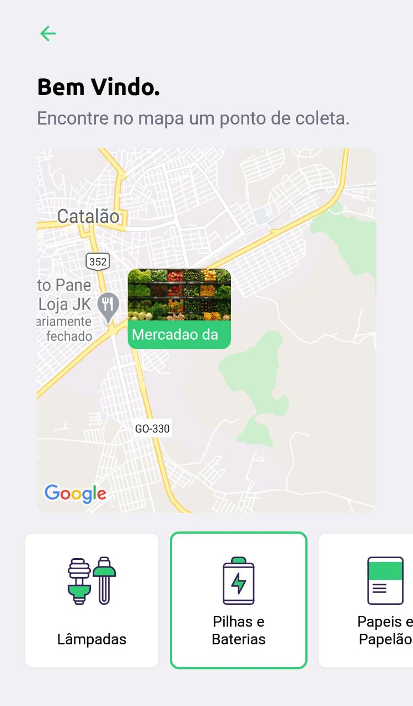
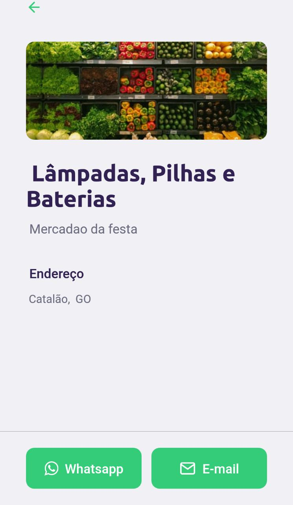

<div align="center" style="display:flex; justify-content:between">
   <a target="_blank" rel="Ecoleta"></a>
  <a target="_blank" rel="Ecoleta"></a>
    <a target="_blank" rel="Ecoleta"></a>
      <br>
</div>

## 💚 Table of contents

<li><a href="#features">Features</a></li><br>
<li><a href="#installation">Installation</a></li><br>
<li><a href="#how-start">The beginning</a></li><br>
<li><a href="#license">License</a></li><br>

## <a id="features"></a>♻️ Features

✅ Register your company's waste collection point.<br>

✅ The company share the default items that can be collected.<br>

## <a id="installation"></a> 🚧 Installation

Verify that you have [Node.js](https://nodejs.org/en/download/) installed and [Expo](https://docs.expo.io/get-started/installation/).

After that run the following commands:

Clone the repository:
````
git clone https://github.com/Newtz/mobile-nlw.git
````
Install the dependencies

````
npm install
````
## <a id="how-start"></a> 🏁 The beginning

<b> Execute the project</b>

````
npm start
````
<b> Then, open expo app in your phone to read the QR code created. </b>

## <a id="license"></a> 🍏 License

Released in 2020. This project is under the [MIT license](https://nodejs.org/en/download/) 
<br>
<br>
🚀 Made by Newton Peixoto
 